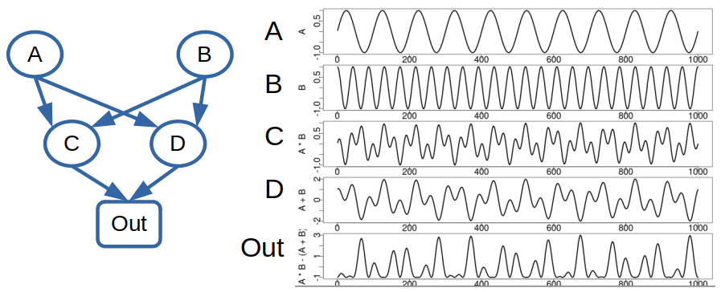
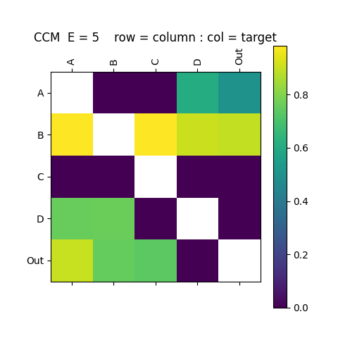
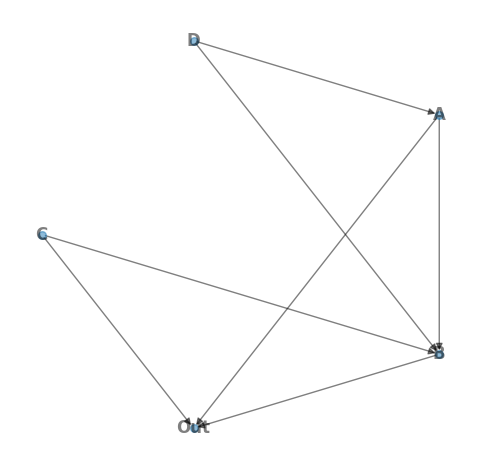

## GMN Example

This simple example demonstrates the processing pipeline on a toy data set with no meaningful network structure or information flow.

The network consists of 5 nodes: `A B C D Out`. Each node represents a time series of length 1000 points with network structure and time series:



---

### Interaction Matrix
The interaction matrix defines the GMN network structure and can be created with the `InteractionMatrix.py` python command-line application (see [Interaction Matrix](overview.md)). Application arguments can be shown with the `-h` argument. Here, we create the interaction matrix from data file `TestData_ABCD.csv` using the EDM convergent cross mapping (CCM) metric, storing the output interaction matrix in `ABCD_iMatrix_E5_tau-3_CCM.csv`.  CCM is passed an embedding dimension of E=5, and time delay of tau=-3. 

```python
./apps/InteractionMatrix.py -d ./data/TestData_ABCD.csv -oc ./output/ABCD_iMatrix_E5_tau-3 -ccm -E 5 -t -3 -P

```

<!--  -->


### Network Creation
The `CreateNetwork.py` application (see [Create Network](overview/)) reads the interaction matrix and creates the `networkx` directed graph object, here stored in a binary file using the python pickle module.

```python
./apps/CreateNetwork.py -i ./output/ABCD_iMatrix_E5_tau-3_CCM.csv -o ./output/ABCD_Network_E5_tau-3_CCM.pkl -d 4 -P
```

<!--  -->

---

### Generative Mode
With a GMN network we can run GMN in generative mode according to the parameters specified in a configuration file (see [Parameters](parameters.md)). `[EDM]` parameters are defined in [EDM Parameters](https://sugiharalab.github.io/EDM_Documentation/parameters/).

Define the configuration file `./network/ABCD_Network_E5_tau-3_CCM.cfg` as :


```python
[GMN]
mode             = Generate
predictionLength = 300
predictionStart  = 700
outPath          = ./output
dataOutCSV       =
showPlot         = True
plotType         = state
plotColumns      = Out A B C D
plotFile         =

[Network]
name       = ABCD 4 Driver
targetNode = Out
file       = ./output/ABCD_Network_E5_tau-3_CCM.pkl
data       = ./data/TestData_ABCD.csv

[Node]
info       = 
data       = 
configPath = 
function   = Simplex

[EDM]
lib             = 
pred            = 
E               = 7
Tp              = 1
knn             = 0
tau             = -3
theta           = 3
exclusionRadius = 0
columns         = 
target          = 
solver          = 
embedded        = False
validLib        = 
generateSteps   = 0
libSizes        = 
sample          = 0
random          = False
includeData     = False
seed            = 0

[Scale]
factor          = 1
offset          = 0
```

From the python console import the gmn package, create the GMN object and run the network in generative mode:

```python
import gmn

G = gmn.GMN( configFile = './network/ABCD_Network_E5_tau-3_CCM.cfg' )

G.Generate()

G.DataOut.tail( 5 )
     Time             A         B       C         D       Out
295   996 -2.487000e-01  0.986701 -0.5018  0.749998 -0.986295
296   997 -1.874000e-01  0.984824 -0.4708  0.793698 -0.990915
297   998 -1.253000e-01  0.963399 -0.4248  0.817698 -0.966998
298   999 -6.280002e-02  0.922292 -0.3671  0.822396 -0.919153
299  1000 -2.438686e-08  0.861684 -0.3016  0.808996 -0.867577
```

The output state plot shows the library (observed time series & state-space) in blue, and GMN generated values in orange.

<center></center>
