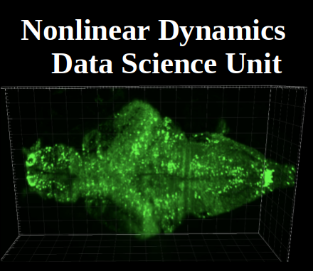

## Generative Manifold Networks (GMN)
---
Generative Manifold Networks are a generalization of nonlinear dynamical systems from a single analytic manifold operator applied to a state-space, to an interconnected network of operators on state-space(s). GMN was introduced by [Pao et al](https://arxiv.org/abs/2106.10627), and under development at the [Biological Nonlinear Dynamics Data Science Unit, OIST](https://www.oist.jp/research/research-units/bndd).

<!--  -->

<a href="https://www.oist.jp/research/research-units/bndd">

</a>
