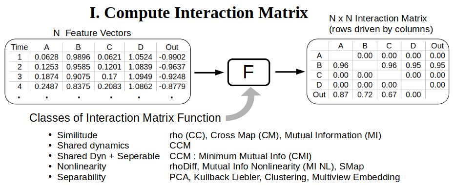
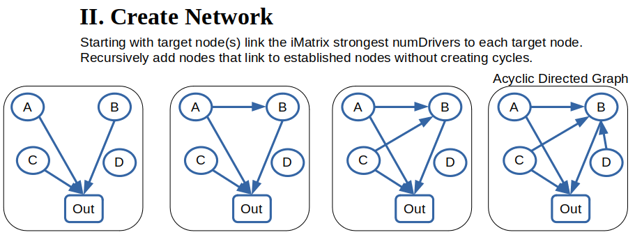
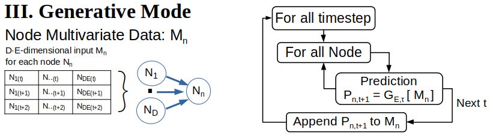

## GMN Overview
---
As science has evolved in conjunction with Moore's law, big data, and the machine learning shift from deductive to inductive reasoning, it has emerged that complex dynamics are often encoded in low-dimensional manifolds: [Sadtler et al. 2014](https://www.nature.com/articles/nature13665), [Finklestein et al. 2021](https://www.nature.com/articles/s41593-021-00840-6), [Bondanelli et al. 2021](https://elifesciences.org/articles/53151), [Fomenko 1994](https://link.springer.com/chapter/10.1007/978-3-642-76235-2_2).  Generative Manifold Networks (GMN) seek to discover and leverage low-dimensional manifolds underlying complex, nonlinear dynamical systems towards understanding and prediction of complex systems. Instead of presuming complex dynamics are encoded in a unitary manifold, GMN represents a complex system as an interacting network of manifolds as conceived by [Pao et al. 2021](https://arxiv.org/abs/2106.10627).

### Manifold Representation
Many state-space analytic methods presume the state-space is an invariant manifold completely encapsulating the system dynamics. Another common presumption is that a diffeomorphic representation of the true manifold can be derived from Takens embedding of a univariate time series observed from the system.  In practice, univariate observations may not sufficiently encapsulate the underlying dynamics, an issue that is compounded as the dimensionaliy and complexity of the dynamics increase. Further, it is not always clear in multidimensional complex systems whether univariate time series observations are soley generated by the presumed dynamics. For example, noise and influences from other related or coupled dynamical systems may be present.

In cases where the dynamics arise from a complex interaction network, the realities of partial observation imply that univariate reconstructions from various time series of the system may not provide diffeomorphic representations of a unitary, underlying manifold, but manifolds expressing different state-space structures. Decomposing the system into an interacting network of manifolds may help to represent the underlying dynamics.

### Network Determination
Manifold network structure is discovered using the convergent cross mapping (CCM) causal inference algorithm to identify causal interactions, then compressed into a reduced redundancy network.

#### Interaction Matrix
The first step is create an interaction matrix (iMatrix) quantifying the interaction potential between nodes in the network. Given a data set with N feature vectors of length M where M corresponds to the number of time series observations, the iMatrix is an NxN matrix with each entry quantified by application of an interaction function F() between all combination of feature vectors. Each feature vector time series corresponds to a `Node` in the GMN `Network`. 

---

---

The application program `InteractionMatrix.py` in the `apps/` directory can create a variety of interaction matrices using different interaction functions F(). Results are stored in a Python pickled dictionary of pandas dataFrames or output as .csv files. See the docstring in `InteractionMatrix.py`. 

The recommended interaction potential function F() is the convergent cross mapping (CCM) minimum mutual information (MI) function referred to as CMI. This function first computes the CCM potential between all nodes (feature vectors). 

The CCM result is the mean prediction skill (cross correlation) of an EDM Simplex predictor over an ensemble of predictions across a spectrum of randomly selected state-space library vectors at each library size. Here a small library result with partial state-space information is compared to a large library size with more complete state-space information. If the difference in prediction skill between the large and small library sizes exceeds a user-defined threshold, CCM is considered to have converged and the positive CCM value is recorded.  Otherwise, a value of 0 is recorded. 

Next, for interaction matrix elements with positive CCM, the mutual information is computed between the two nodal feature vectors (time series). The value of mutual information is recorded as the interaction Matrix result. In the next step of network creation, drivers (input node time series) are ranked according to minumum mutual information. 

Avialable methods :

| Method | Label | CLI argument |
|--------|-------|--------------|
| All Metrics                     |         | -a --allMethods |
| Cross Correlation               | CC      | -rho     |
| Simplex Cross Map               | CM      | -cmap    |
| Convergent Cross Map            | CCM     | -ccm     |
| rho Diff = max(CM, 0) - abs(CC) | rhoDiff | -rhoDiff |
| Mutual Information              | MI      | -mi      |
| Mutual Information Non Linearity| MI_NL   | -nl      |
| SMap nonlinearity               | SMap    | -smap    |
| CCM : Mutual Information        | CMI     | -cmi     |

---

#### Network Creation

Once an interaction matrix is defined the application program `CreateNetwork.py` in the `apps/` directory can build the GMN network.  The network is created as a [`networkx`](https://networkx.org/) acyclic directed graph (DiGraph) and stored in a Python dictionary with keys `Graph` : the networkx DiGraph, and `Map` : a Python dictionary of node names. The output is stored as either a Python pickled object or json file.

Nodes are added recursively starting at the output node(s), adding links according to the network interaction matrix until the limit of node drivers is reached, and, disallowing the creation of network cycles.  The number of drivers is a network property specified as a command line argument (`-d`, `--numDrivers`) to `CreateNetwork.py`.




#### Generative Mode

Once a network is created GMN can be run to generate time series at the output nodes. First a `GMN` class object is created from the `gmn` package and initialized according to the configuration file.

```python
import gmn
G = gmn.GMN( configFile = 'config/default.cfg' )
```
The network can then be run in generative mode:

```python
G.Generate()
```


